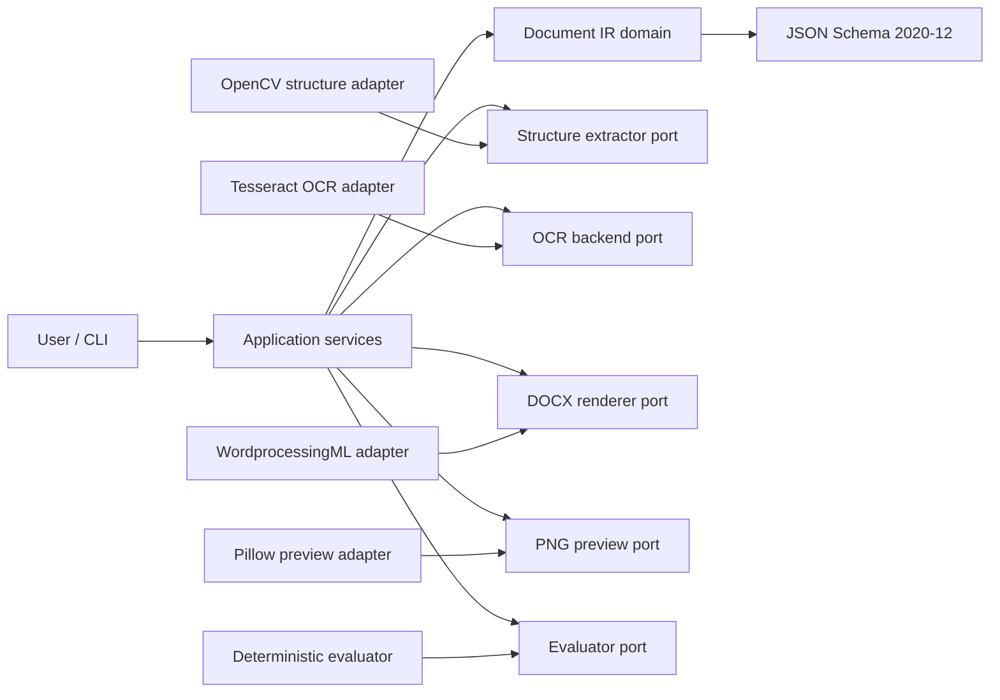
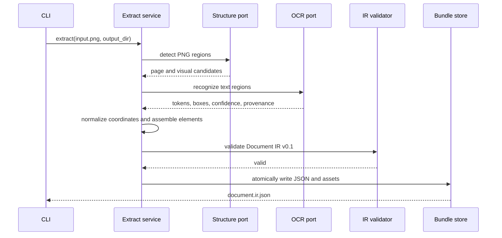
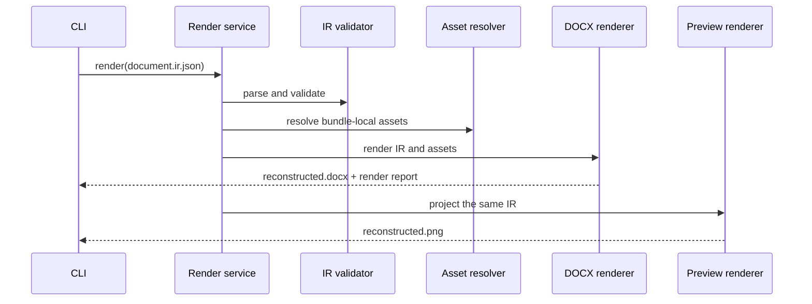

# Aiteqno V1 Architecture

| Field | Value |
| --- | --- |
| Status | Accepted |
| Decision date | 2026-08-16 |
| Parent | [Issue #7](https://github.com/Kentaro-Ono-jp/Aiteqno/issues/7) |
| Implements | [Issue #12](https://github.com/Kentaro-Ono-jp/Aiteqno/issues/12) |

## 1. Purpose

Aiteqno V1 converts a single-page PNG into a versioned Document IR, then
reconstructs a readable DOCX from that IR without consulting the source image.
The reconstructed document is an approximation, not a pixel-perfect copy.

This document is the contract for Issues #13 through #24. Implementations may
change internal algorithms, but they must not change the contracts in this
document without first updating this architecture in a separate design PR.

The terms **MUST**, **MUST NOT**, **SHOULD**, and **MAY** are normative.

## 2. V1 scope

### 2.1 Inputs and outputs

| Role | V1 contract |
| --- | --- |
| Source input | One rasterized, single-page PNG |
| Canonical intermediate representation | `document.ir.json` plus referenced assets |
| Formal reconstructed artifact | `reconstructed.docx` |
| Comparison artifact | `reconstructed.png` |
| Quality artifact | `evaluation.json` |

DOCX is the formal reconstruction result. PNG is a deterministic projection of
the same IR for visual inspection and machine evaluation; it is not a second
source of truth.

### 2.2 V1 elements

V1 supports these element types:

- `text`
- `line`
- `rectangle`
- `image`

The IR uses a `pages` array so that a later version can support multi-page
documents without replacing the root structure. V1 extraction MUST produce
exactly one page.

### 2.3 Explicit non-goals

- Pixel-perfect or 100% reconstruction
- PDF input
- DOCX input
- Multi-page extraction
- Semantic `table` elements
- `form.schema.json` or `form.data.json`
- HTTP API, Flask, GUI, or hosted service
- Using the original page image as a DOCX or PNG background
- Preserving every unsupported visual effect silently

## 3. Quality objective

V1 optimizes for **readable structural equivalence**:

1. Important text remains readable.
2. Reading order remains understandable.
3. Major regions and their relationships remain recognizable.
4. The DOCX opens without repair in common DOCX applications.

A composite restoration score of approximately 70/100 is acceptable when all
readability gates pass. A higher numeric score does not compensate for missing
essential text, an unreadable reading order, an invalid DOCX, or a result that
requires the source image to understand.

## 4. System boundaries



### 4.1 Dependency direction

The future `src/aiteqno/` package MUST follow these dependency rules:

| Layer | Responsibility | May depend on |
| --- | --- | --- |
| `domain` | IR types, invariants, errors | Python standard library only |
| `ports` | Protocols for OCR, structure, rendering, assets, evaluation | `domain` |
| `application` | Extract, render, preview, evaluate, roundtrip orchestration | `domain`, `ports` |
| `adapters` | OpenCV, Tesseract, DOCX, Pillow, filesystem implementations | `domain`, `ports` |
| `cli` | Argument parsing, exit codes, user diagnostics | `application` |

The domain MUST NOT import an adapter. Application services MUST receive ports
through constructors or function parameters. Adapters MUST NOT call the CLI.
This prevents OCR, rendering, and extraction implementations from depending on
each other or forming a cycle.

The V1 runtime is implemented exclusively by the installable `src/aiteqno`
package. The pre-V1 prototype has been removed from the active tree and remains
available through Git history only. Runtime and test code MUST NOT import source
files outside the package. See [the V1 migration note](migration-v1.md) for the
replacement commands and data contract.

## 5. Processing sequences

### 5.1 Extract



### 5.2 Render and preview



The render path MUST NOT accept or discover the original PNG. Removing the
source PNG after extraction MUST NOT prevent DOCX or preview generation.

## 6. Document IR v0.1 contract

Issue #14 will implement the normative Python model and JSON Schema. The schema
MUST use JSON Schema Draft 2020-12 and live at:

```text
schemas/document-ir-v0.1.schema.json
```

### 6.1 Bundle layout

An extracted document is a self-contained directory:

```text
document-bundle/
├── document.ir.json
└── assets/
    └── sha256-<digest>.<extension>
```

Asset paths are relative to `document.ir.json`. Absolute paths, `..` traversal,
URLs, and `data:`/Base64 payloads are forbidden in V1. Rendering is offline and
MUST NOT fetch network resources.

### 6.2 Root document

The root object has these fields:

| Field | Required | Contract |
| --- | --- | --- |
| `ir_version` | Yes | Exact V1 value `0.1.0` |
| `document_id` | Yes | Stable non-empty identifier |
| `generator` | Yes | Object containing non-empty `name` and `version` strings |
| `pages` | Yes | Non-empty page array; exactly one page in V1 extraction |
| `assets` | Yes | Asset metadata array; may be empty |
| `metadata` | No | Source-independent document metadata |
| `extensions` | No | Namespaced extension object |

`created_at` MAY be stored in `metadata`, but tests and element IDs MUST NOT
depend on a clock value.

### 6.3 Canonical coordinate system

- Origin: top-left of the page
- Positive X: right
- Positive Y: down
- Canonical unit: typographic point (`pt`)
- One inch: 72 pt
- Values: finite JSON numbers, zero or positive unless a field says otherwise

Page size and every bounding box are expressed in points. Extractors initially
work in source pixels and convert at the application boundary:

```text
x_pt = x_px * 72 / dpi_x
y_pt = y_px * 72 / dpi_y
```

If a PNG has no trustworthy DPI metadata, the extractor MUST record that the
DPI was inferred and use the configurable V1 fallback of 96 DPI. The original
pixel dimensions, effective `dpi_x`, `dpi_y`, and whether each value was
declared or inferred MUST remain in page provenance.

The preview renderer converts points to pixels at a requested evaluation DPI.
The deterministic default is 144 DPI:

```text
x_px = x_pt * preview_dpi / 72
```

Rounding occurs only at the final raster boundary. Domain and JSON values retain
floating-point point coordinates.

### 6.4 Page

Each page has:

| Field | Required | Contract |
| --- | --- | --- |
| `id` | Yes | Unique within the document |
| `number` | Yes | One-based page number |
| `size` | Yes | `width`, `height`, and `unit: "pt"` |
| `source` | No | Pixel size and declared/inferred DPI metadata |
| `elements` | Yes | Ordered element array |
| `extensions` | No | Namespaced extension object |

`elements` is stored in normalized reading order. Visual paint order is defined
separately by `z_index`.

### 6.5 Common element fields

All V1 elements share:

| Field | Required | Contract |
| --- | --- | --- |
| `id` | Yes | Stable and unique within the document |
| `type` | Yes | `text`, `line`, `rectangle`, or `image` |
| `bbox` | Yes | Point-valued `x`, `y`, `width`, `height` |
| `z_index` | Yes | Integer; higher values paint later |
| `confidence` | Yes | Confidence object or `null` for manual fixtures |
| `provenance` | Yes | Non-empty provenance record array |
| `extensions` | No | Namespaced extension object |

Bounding boxes MUST be contained by the page within a small schema-defined
numeric tolerance. Width and height MUST be positive for `text`, `rectangle`,
and `image`. A `line` MAY have a zero-width or zero-height bounding box, but not
both. Its bounding box MUST enclose both endpoints.

For equal `z_index`, array order is the paint-order tie breaker. Stable element
IDs are assigned after normalization using page number, element type, and the
zero-padded position in reading order, for example `p001-text-0007`. Algorithms
MUST NOT use random UUIDs for extracted elements.

### 6.6 Element-specific fields

#### Text

| Field | Required | Notes |
| --- | --- | --- |
| `text` | Yes | Unicode string; may be empty only before OCR enrichment |
| `reading_order` | Yes | Zero-based integer within the page |
| `style` | Yes | Text style object |

Text style contains `font_family`, `font_size_pt`, `font_weight`, `font_style`,
`color`, `align`, `line_height`, and `rotation_deg`. V1 formally supports
horizontal text with `rotation_deg: 0`. Other rotations are preserved but MAY
produce a renderer warning and fallback.

#### Line

Line fields are `start`, `end`, and `style`. Start and end use page-point
coordinates. Style contains `width_pt`, `color`, and `dash`. Axis-aligned lines
are the guaranteed V1 DOCX subset; diagonal lines are retained in IR but may use
a documented fallback.

#### Rectangle

Rectangle style contains `stroke_color`, `stroke_width_pt`, `fill_color`, and
`corner_radius_pt`. V1 guarantees square corners. A non-zero corner radius is
retained but MAY be approximated as square in DOCX.

#### Image

Image fields are `asset_id`, `fit`, and optional `alt_text`. `fit` is one of
`contain`, `cover`, or `stretch`; `contain` is the default. The renderer resolves
the image through the asset registry, never directly from an arbitrary path.

### 6.7 Style values

Colors use lower-case `#rrggbb` or `null` for no paint. Opacity is a number from
0 through 1. Font families are hints, not embedded fonts. Renderers MUST define
a deterministic fallback chain and MUST report a fallback when the requested
font is unavailable.

V1 style objects are strict: unknown fields are rejected. Experimental values
belong under a namespaced key in `extensions`, such as:

```json
{
  "extensions": {
    "jp.reactorfront.aiteqno.experimental": {
      "example": true
    }
  }
}
```

### 6.8 Confidence

`confidence` is either `null` or an object with values normalized to 0 through
1:

| Field | Meaning |
| --- | --- |
| `overall` | Required combined confidence |
| `detection` | Optional region/geometry confidence |
| `recognition` | Optional OCR confidence |

Manual and canonical fixtures use `null`; extracted elements MUST provide at
least `overall`. Backend-specific sentinel values, such as a negative OCR
confidence, normalize to `null` rather than an invented score.

### 6.9 Provenance

Each provenance record has:

- `stage`: `manual`, `structure`, `ocr`, `normalize`, or `derived`
- `provider`: stable implementation name
- `provider_version`: implementation or external engine version
- `source_refs`: zero or more source element/region identifiers
- `source_bbox_px`: optional original pixel box
- `parameters_digest`: optional hash of relevant configuration
- `notes`: optional concise diagnostic information

An element can have multiple records. For example, an OCR text element carries
one structure-detection record and one recognition record. Implementations MUST
append provenance rather than overwriting the preceding stage.

### 6.10 Assets

Each asset registry entry has:

- `id`
- bundle-relative `path`
- `media_type`
- lowercase hexadecimal `sha256`
- `pixel_width` and `pixel_height`
- optional `dpi_x` and `dpi_y`

Asset filenames are content-addressed. Writers MUST write to a temporary file,
verify the digest, and atomically move it into the bundle. Readers MUST resolve
the final path and verify it remains inside the bundle root.

V1 portable image assets use `image/png` or `image/jpeg`. An extractor MAY
decode another source format, but it must normalize the stored asset to one of
these media types before creating the bundle.

The full source page MUST NOT be copied into assets as a background. An actual
image region contained in the document MAY be cropped and stored as an asset.
If an image candidate substantially covers the page, extraction MUST classify it
for review rather than use it to bypass reconstruction.

### 6.11 Versioning and compatibility

- `0.1.x` patch releases are backward-compatible clarifications or optional
  additions under existing extension points.
- A change to required fields, units, element meaning, or rendering semantics
  requires a new minor version while major version is zero, such as `0.2.0`.
- V1 readers MUST accept supported `0.1.x` documents and reject unknown minor or
  major versions with an actionable error.
- Readers MUST NOT guess a missing version.
- Migration is explicit: `migrate(source_version, target_version)` creates a new
  document and records a `derived` provenance entry.
- The schema is strict with `additionalProperties: false`; namespaced
  `extensions` is the compatibility escape hatch.

### 6.12 Illustrative instance

This example explains the shape but is not the normative schema:

```json
{
  "ir_version": "0.1.0",
  "document_id": "clinic-form-001",
  "generator": {"name": "aiteqno", "version": "0.3.0"},
  "metadata": {"title": "Sample form"},
  "assets": [],
  "pages": [
    {
      "id": "page-001",
      "number": 1,
      "size": {"width": 595.28, "height": 841.89, "unit": "pt"},
      "source": {
        "pixel_width": 794,
        "pixel_height": 1123,
        "dpi_x": 96,
        "dpi_y": 96,
        "dpi_source": "inferred"
      },
      "elements": [
        {
          "id": "p001-text-0000",
          "type": "text",
          "bbox": {"x": 48, "y": 42, "width": 210, "height": 24},
          "z_index": 10,
          "text": "問診票",
          "reading_order": 0,
          "style": {
            "font_family": "Noto Sans CJK JP",
            "font_size_pt": 18,
            "font_weight": 700,
            "font_style": "normal",
            "color": "#000000",
            "align": "left",
            "line_height": 1.2,
            "rotation_deg": 0
          },
          "confidence": {"overall": 0.94, "recognition": 0.94},
          "provenance": [
            {
              "stage": "ocr",
              "provider": "tesseract",
              "provider_version": "5.x",
              "source_refs": ["region-0000"]
            }
          ]
        }
      ]
    }
  ]
}
```

## 7. DOCX reconstruction contract

### 7.1 Formal artifact

`reconstructed.docx` MUST be a valid Open Packaging Convention document and
MUST open without a repair prompt in Microsoft Word and LibreOffice. V1 favors
widely supported WordprocessingML structures over fragile absolute-positioned
DrawingML.

### 7.2 Flow-first layout strategy

The renderer uses this deterministic strategy:

1. Validate the complete IR and assets before creating output.
2. Sort elements by normalized reading order and `z_index`.
3. Cluster elements into horizontal bands using vertical overlap and a
   point-based tolerance.
4. Derive approximate column boundaries from X positions.
5. Build fixed-width, borderless tables for multi-column bands.
6. Place text as paragraphs/runs and images as inline pictures inside cells.
7. Express axis-aligned lines and rectangles with paragraph or table borders.
8. Record every approximation, fallback, or omission in a render report.

This strategy intentionally trades exact coordinates for readability and DOCX
interoperability. Raw OOXML MAY be used behind the DOCX adapter when the
high-level library lacks a required feature, but it MUST have Word and
LibreOffice compatibility tests.

### 7.3 IR-to-DOCX mapping

| IR concept | V1 DOCX mapping | Fallback |
| --- | --- | --- |
| Page size/orientation | Word section page properties | Fail if invalid |
| Text | Paragraph and runs in a spatial band/cell | Substitute font and warn |
| Horizontal/vertical line | Paragraph or table border | Element-only raster fallback or warn |
| Rectangle | One-cell table/borders and optional shading | Square-corner approximation |
| Image | Inline picture sized from point bbox | Placeholder + warning in best-effort mode |
| Z-order | Deterministic insertion/layer approximation | Warn when exact overlap is impossible |

The implementation MUST expose `best_effort` and `strict` policies. CLI defaults
to `best_effort`: unsupported non-essential visuals generate warnings, but
missing essential text or an invalid asset fails. `strict` fails on every
unsupported element or fallback.

### 7.4 Render report

Rendering returns the artifact and a machine-readable report containing:

- renderer name and version
- IR version
- output path and SHA-256
- rendered element IDs
- fallback element IDs
- omitted element IDs
- warnings and errors
- font substitutions

No element may disappear silently.

### 7.5 DOCX validation gates

The implementation progresses through these gates:

1. OPC/ZIP structure is readable.
2. The chosen Python DOCX library can reopen the document.
3. LibreOffice headless can open and convert the golden document in CI.
4. A release candidate receives a manual Microsoft Word smoke check on Windows.

The architecture does not require Microsoft Word automation in CI.
`LibreOfficeSnapshotRenderer` performs gate 3 with an isolated temporary user
profile and retains no converted artifact. The V1 golden evaluation awards no
geometry credit when no page regions were measured; it must clear the quality
threshold through independently observed text, elements, and structure.

## 8. PNG preview contract

- Input is validated IR plus bundle assets only.
- Default rasterization is 144 DPI and is configurable.
- Rendering uses the same point-coordinate interpretation and paint order as
  DOCX.
- Font fallback is deterministic and appears in a preview report.
- `reconstructed.png` contains only Document IR elements. Guide lines, OCR
  boxes, confidence heat maps, debug labels, and source-image backgrounds are
  not product features and MUST NOT be emitted.
- A future diagnostic renderer would require a separate artifact contract; V1
  exposes no debug-overlay mode.

The preview enables geometry comparison without making PNG the formal result.

## 9. Extraction and OCR contracts

### 9.1 Structural extraction boundary

The structure adapter receives decoded PNG pixels and immutable source metadata.
It returns candidate regions in source pixels. It does not create domain IDs,
write JSON, call OCR, or render output.

The application layer converts candidates to points, normalizes duplicates,
combines OCR tokens, assigns stable IDs, creates assets, and validates the final
IR.

Issue #20 fixes the V1 orchestration rules as follows:

- candidate collections are normalized by source geometry before IDs are
  assigned; extracted IDs never depend on a clock or random value;
- OCR tokens are associated by their provider-supplied region reference first,
  then by deterministic source-pixel overlap, and text reading order is
  normalized into top-to-bottom rows and left-to-right tokens;
- structure detection and OCR recognition confidence remain separate fields,
  while `overall` uses the conservative minimum of the available values;
- line, rectangle, image, and text paint layers use deterministic `z_index`
  values while the element array preserves text reading order;
- only detected image-region crops become content-addressed PNG assets;
  candidates covering 85% or more of the page are omitted with a diagnostic;
- the complete `document.ir.json` and `assets/` tree is staged beside the target
  and published through a same-filesystem rename. An existing output directory
  is never overwritten.

### 9.2 OCR adapter protocol

The adapter boundary is conceptually:

```python
class OcrBackend(Protocol):
    def healthcheck(self) -> OcrCapabilities: ...

    def recognize(
        self,
        image: ImageInput,
        regions: Sequence[PixelRegion],
        languages: Sequence[str],
        options: OcrOptions,
    ) -> Sequence[OcrToken]: ...
```

`OcrToken` contains text, pixel bbox, normalized confidence, provider/model
metadata, and optional parent region ID. Domain and application code must not
import `pytesseract` or Tesseract-specific types.

The port also provides a deterministic fake backend for unit tests. External OCR
is reserved for adapter integration and E2E tests.

### 9.3 V1 standard OCR backend decision

V1 selects **Tesseract 5.x through `pytesseract`** as the standard local backend.
Implementation uses the latest stable releases available when Issue #19 begins,
subject to the repository dependency policy.

At this decision date, the latest upstream Tesseract release is 5.5.3. This is
recorded for auditability, not used as a permanent architecture pin.

Decision criteria:

| Criterion | V1 requirement | Tesseract decision |
| --- | --- | --- |
| Japanese | Japanese and mixed Latin text | Official `jpn` and `eng` trained data |
| Windows | Reproducible on supported Windows | Tesseract documents Windows 10/11 support |
| CI | Local, non-interactive execution | Install engine and language data in runner |
| Geometry | Text, bbox, confidence | TSV exposed through `image_to_data` |
| License | Compatible with MIT project distribution | Apache-2.0 engine |
| Network | No mandatory cloud call | Entirely local |
| Replaceability | No engine types in domain | Isolated adapter behind `OcrBackend` |

The default language order is `jpn+eng`. The adapter records engine version,
trained-data languages, page segmentation mode, and a configuration digest in
provenance. It MUST provide a configurable executable path and `TESSDATA_PREFIX`
rather than hard-code a Windows installation directory.

`healthcheck()` MUST diagnose these separately:

- executable missing
- unsupported engine version
- requested trained data missing
- unreadable input
- timeout
- engine process failure

Cloud OCR, a GPU runtime, or a large neural framework may be added later as a
separate adapter. None is a V1 prerequisite.

## 10. Restoration evaluation contract

### 10.1 Reference data

Machine evaluation uses a reviewed golden fixture containing:

- source PNG
- expected Document IR or annotated expected elements
- essential text anchors
- expected structural relationships
- fixture license and provenance

Evaluation of an arbitrary unreviewed document cannot prove human readability.
Such a result is `requires_human_review`, never an automatic pass.

The formal restoration target is the generated DOCX, not
`reconstructed.png`. The evaluator therefore observes the candidate through:

- text, paragraphs, tables, relationships, and media read back from the DOCX
- the renderer's machine-readable render report
- a normalized page snapshot produced by opening/rendering the DOCX with
  LibreOffice headless in E2E validation

`reconstructed.png` is useful for diagnosing the IR and preview adapter, but it
MUST NOT substitute for observing the DOCX in the formal restoration score.

The normalized evaluation boundary is represented by
`RestorationEvaluationInput`. It contains the IR version/schema result, a
reviewed `EvaluationReference`, a `DocxObservation`, the exact
`DocxRenderReport` for that file, an optional `SnapshotObservation`, and any
completed manual checks. `PythonDocxObserver` reads the OPC package and
`python-docx` reopen result, then normalizes visible text, borders, media,
reading order, containment, and adjacency. Neither the input model nor the
metric layer imports an OCR backend.

### 10.2 Composite score

The restoration score is 0 through 100:

```text
score = 100 * (
    0.45 * text_similarity
  + 0.20 * element_coverage
  + 0.20 * structure_similarity
  + 0.15 * geometry_similarity
)
```

| Component | Definition |
| --- | --- |
| `text_similarity` | DOCX text read back and Unicode NFKC + whitespace-normalized against reviewed text |
| `element_coverage` | Precision/recall F1 of expected elements represented in DOCX and the render report |
| `structure_similarity` | F1 of reading-order, containment, and adjacency relationships observed in DOCX |
| `geometry_similarity` | Normalized visual-region overlap/position score from the rendered DOCX snapshot |

Matching is deterministic and uses these frozen V1 rules:

- the render report must list the expected element as rendered and not omitted;
- page number and element type must agree;
- text elements require NFKC/whitespace-normalized character similarity of at
  least `0.60`;
- image digests, when available on both sides, must agree;
- eligible pairs are ranked by content, geometry, and an explicit source-ID
  hint, then greedily assigned with reference ID and observed ID as tie breakers;
- text similarity uses Python's deterministic `SequenceMatcher` with
  `autojunk=False` over the complete normalized reading order;
- element and structure scores use precision/recall F1, with both-empty sets
  scoring 1 and a one-sided empty set scoring 0;
- geometry for each expected region is
  `0.70 * IoU + 0.30 * max(0, 1 - center_distance / sqrt(2))`; missing regions
  score 0, and the component is the arithmetic mean.

Component weights are part of the V1 contract and are not configurable. The
inclusive pass threshold defaults to 70 and may be configured from 0 through
100. Component values are retained to six decimal places and the final score is
rounded to two decimal places before applying the threshold.

### 10.3 Result states

- `pass`: the rounded score is at least the configured threshold, every hard
  gate passes, the reference is reviewed, and all declared human checks are
  complete.
- `fail`: the score is below threshold or any hard gate fails. Failure takes
  precedence over review state.
- `requires_human_review`: the numeric score and known gates do not fail, but
  the reference is unreviewed, a gate lacks machine evidence, or a declared
  human check remains incomplete. It is never an automatic pass.

### 10.4 Hard gates

All of these must pass regardless of numeric score:

1. IR schema validity and the IR versions in the reference and render report
   agree.
2. The DOCX OPC package is readable and `python-docx` can reopen it.
3. The render report SHA-256 matches the DOCX that was actually observed.
4. LibreOffice or equivalent snapshot evidence establishes repair-free opening;
   absent evidence is unknown and forces human review rather than pass.
5. Every fixture-designated essential text anchor is present after DOCX
   read-back.
6. Essential reading-order, containment, and adjacency relationships survive.
7. Every essential element is present in both DOCX observation and render
   report.
8. No source page background is used to fake reconstruction.
9. No fatal render error, essential omission, or required-asset failure exists.
10. The generated DOCX contains no external relationship.

A 70-point document with a missing patient-name label therefore fails. A
70-point document with approximate spacing but readable content may pass.

### 10.5 Evaluation artifact

`evaluation.json` records:

- evaluator and IR versions
- fixture/reference ID
- overall score and threshold
- each component score and weight
- matched, missing, and unexpected elements
- hard-gate results
- final state
- reasons and required human checks

`FilesystemEvaluationWriter` publishes UTF-8 JSON with stable key ordering and
create-only semantics; it never overwrites an existing artifact. The practical
API and artifact examples are in [the restoration evaluation guide](evaluation.md).

## 11. CLI and artifact contract

The V1 CLI implements:

```powershell
aiteqno extract input.png -o document.ir.json
aiteqno render document.ir.json -o reconstructed.docx
aiteqno preview document.ir.json -o reconstructed.png
aiteqno roundtrip input.png -o output/
```

The standalone `extract` command writes `assets/` beside the requested JSON.
`render` and `preview` resolve that sibling directory and never consult the
original PNG.

`roundtrip` produces:

```text
output/
├── document.ir.json
├── assets/
├── reconstructed.docx
└── reconstructed.png
```

Commands use distinct non-zero exit codes for invalid usage, invalid input,
output conflicts, missing runtime dependencies, and operational failures.
Human-readable diagnostics go to stderr; successful absolute artifact paths go
to stdout. Every output is create-only. The complete PowerShell, path, stream,
and exit-code contract is defined in [the V1 CLI guide](cli.md).

## 12. Security and robustness

PNG, JSON, assets, and DOCX are untrusted data boundaries.

- Enforce configurable pixel and file-size limits before decoding PNG.
- Reject non-finite numbers, negative sizes, duplicate IDs, and out-of-page
  geometry outside tolerance.
- Resolve and verify asset paths inside the bundle root.
- Verify media type, digest, and decoded image dimensions.
- Apply timeouts to external OCR processes.
- Do not enable macros or external relationships in generated DOCX.
- Do not make network requests while parsing or rendering.
- Write JSON, assets, and DOCX atomically.
- Avoid logging recognized document content by default.

## 13. Traceability to implementation Issues

| Issue | Contract implemented |
| --- | --- |
| #13 | Package layers and dependency direction |
| #14 | Section 6 IR model and schema |
| #15 | Basic DOCX page/text mapping |
| #16 | DOCX line/rectangle/image mapping and reports |
| #17 | Section 8 preview renderer |
| #18 | Structural extraction boundary |
| #19 | OCR adapter and Tesseract backend |
| #20 | Extraction orchestration, assets, validation |
| #21 | Section 11 CLI |
| #22 | Section 10 evaluator |
| #23 | Golden E2E and DOCX validation gates |
| #24 | Legacy removal and documentation cutover |

## 14. References

- [JSON Schema Draft 2020-12](https://json-schema.org/draft/2020-12)
- [Microsoft: WordprocessingML document structure](https://learn.microsoft.com/en-us/office/open-xml/word/how-to-open-and-add-text-to-a-word-processing-document)
- [python-docx: sections, page dimensions, and margins](https://python-docx.readthedocs.io/en/latest/user/sections.html)
- [python-docx: tables and pictures](https://python-docx.readthedocs.io/en/latest/user/quickstart.html)
- [Tesseract supported operating systems](https://tesseract-ocr.github.io/tessdoc/supported-operating-systems.html)
- [Tesseract installation and language data](https://tesseract-ocr.github.io/tessdoc/Installation.html)
- [Tesseract language support](https://tesseract-ocr.github.io/tessdoc/Data-Files-in-different-versions.html)
- [pytesseract output APIs](https://github.com/madmaze/pytesseract)
- [Tesseract Apache-2.0 license](https://github.com/tesseract-ocr/tesseract/blob/main/LICENSE)
